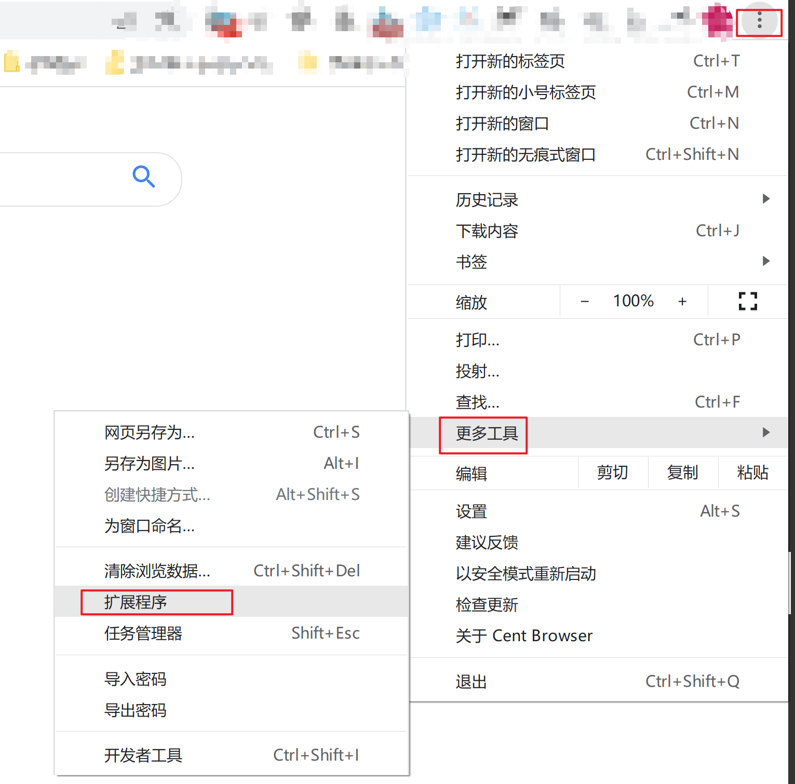
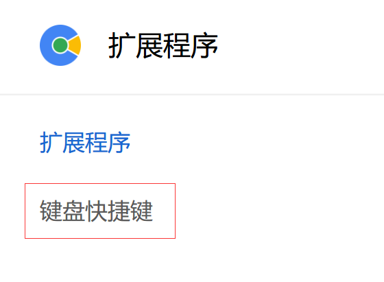
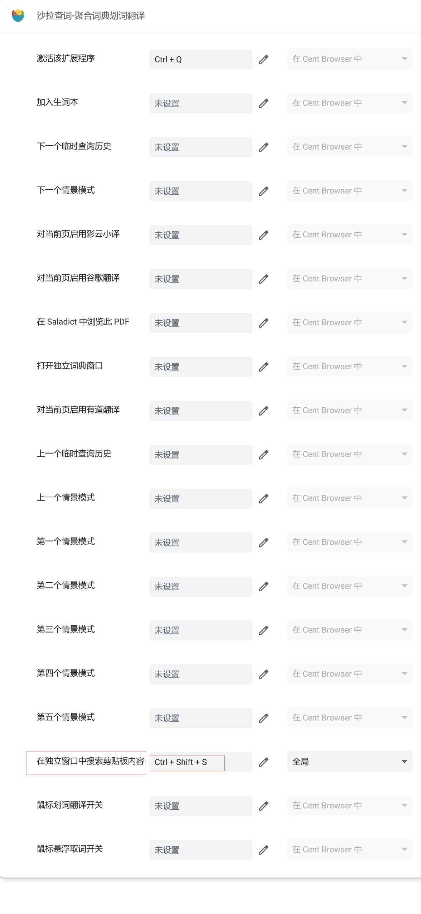
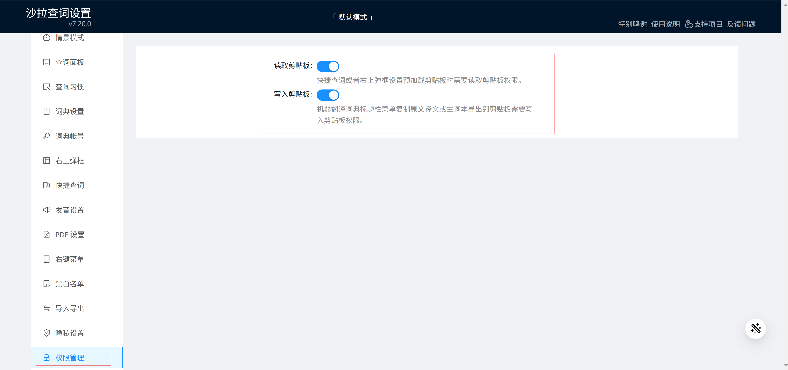
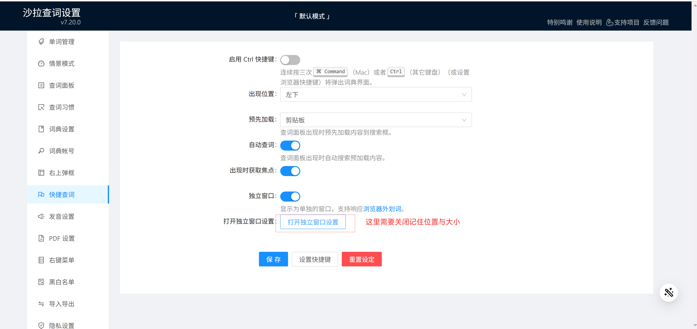
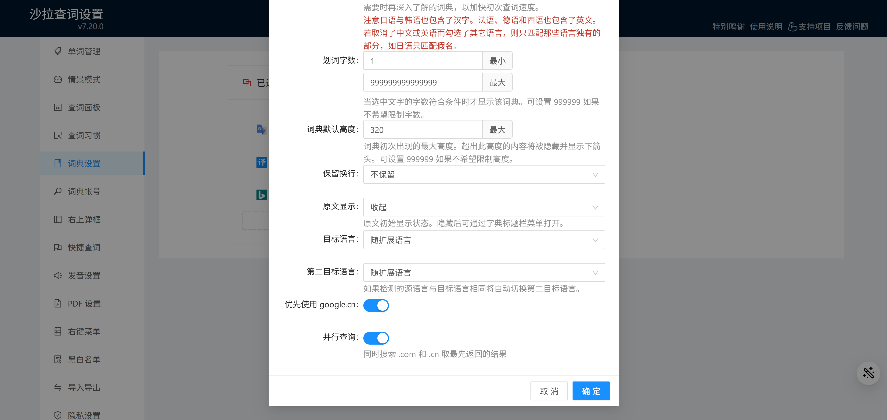
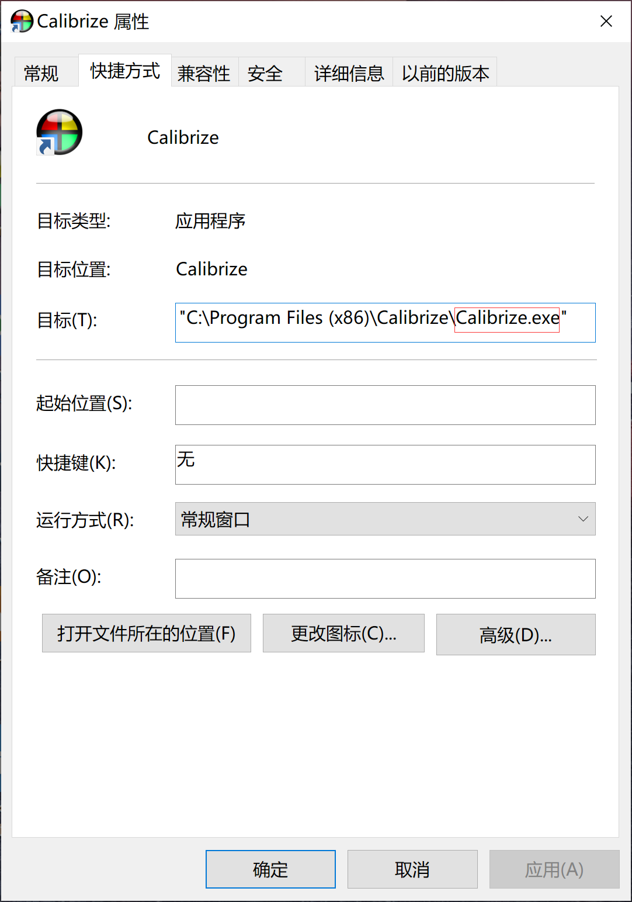
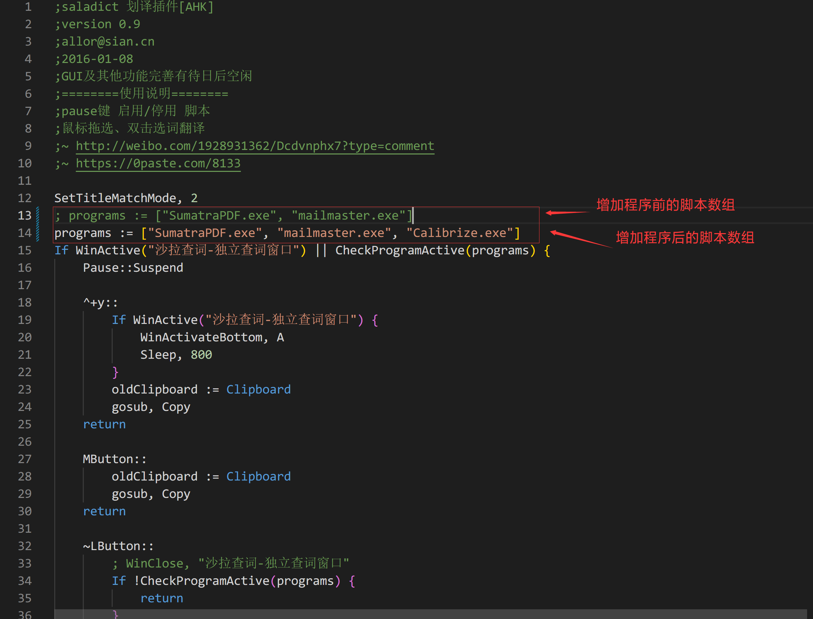
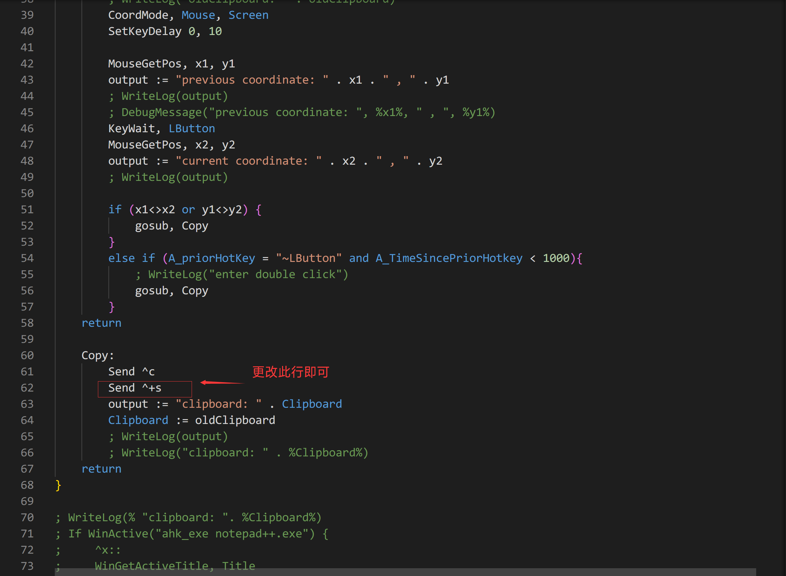
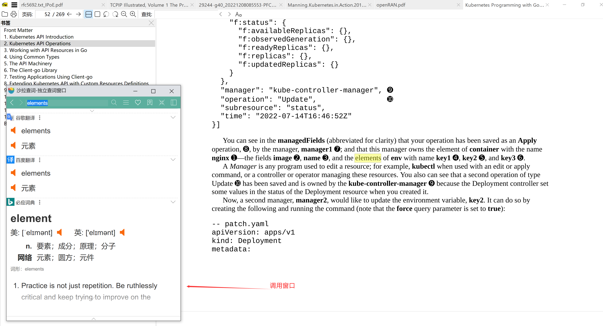

# saladict-external-translate
外部程序调用沙拉查词进行翻译

## 注意事项

1. 目前该程序支持在sumatraPDF调用沙拉查词进行翻译，如需要在自己的程序上调用，则需要增加自己的程序名称进入源码
2. 在调用前需要先设置chrome沙拉查词调用快捷键，目前脚本里面调用的是Ctrl+Shift+s快捷键进行调用

## 使用步骤

### chrome浏览器沙拉查词扩展设置

#### 设置chrome扩展快捷键

1. 打开chrome更多（三个点）--> 更多设置 --> 扩展程序

   

2. 打开扩展快捷键设置

   

3. 设置沙拉查词快捷键为Ctrl+Shift+S

   

#### 沙拉查词扩展设置

1. 开启沙拉查词剪贴板权限

   

2. 沙拉查词快捷键查词设置

   



3. 词典设置不保留换行

   



## 高级设置

```
高级设置需要更改脚本然后使用，这是由于原来的exe无法更改，这需要你自己到autohotkey官网下载v1.1的解释器https://www.autohotkey.com/download/ahk-install.exe，然后安装双击修改后的脚本运行
```


### 增加外部调用的程序

1. 属性中获取程序的名称

   

2. 将程序名添加进入脚本数组中

   

### 更改调用的快捷键

更改调用的快捷键需要将脚本中调用的快捷键以及chrome中调用的快捷键一同更改才可生效，autohotkey快捷键见教程https://wyagd001.github.io/zh-cn/docs/Tutorial.htm#s21



## 使用效果

下图为sumatraPDF中外划词的效果
